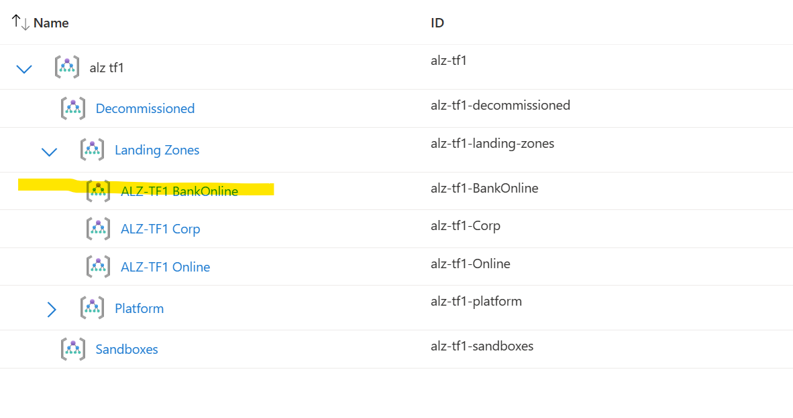
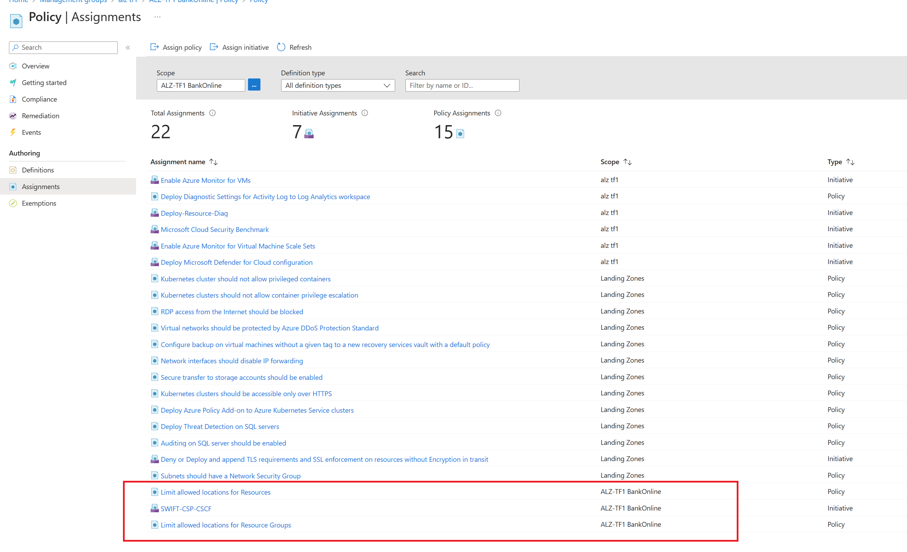

# Azure landing zones custom archetypes using Terraform


In this post, I will explain how to use custom archetypes of Azure Landing Zones and how to automate this deployment using enterprise landing zones [module in terraform](https://registry.terraform.io/modules/Azure/caf-enterprise-scale/azurerm/latest)&nbsp;  
&nbsp;  
**[Azure Landing Zones](https://learn.microsoft.com/en-us/azure/cloud-adoption-framework/ready/landing-zone/)** are an important aspect of cloud adoption for organizations. They provide a foundation for consistent deployment of resources, governance, and security across an organization's Azure environment. However, out-of-the-box Azure Landing Zones may not meet the specific needs of all organizations. This is where custom archetypes can help us to meet this particular requirements.  
   
Custom archetypes are based on the organization's specific needs, such as its industry, regulatory compliance, and security requirements. Custom archetypes can be designed to meet the specific needs of different business units within an organization.&nbsp;  
&nbsp;  
One of the biggest benefits of custom archetypes is that they can help organizations reduce the time and effort required to deploy a Landing Zone. Custom archetypes can be pre-configured with the necessary components, such as virtual networks, subnets, security policies, and Azure resources, that are required to support the organization's workload. This can help organizations speed up the deployment process and ensure consistency across all of their Azure environments.&nbsp;  
&nbsp;  
Another benefit of custom archetypes is that they can help organizations ensure compliance with regulatory requirements. Custom archetypes can be designed to meet specific regulatory requirements, such as [SWIFT](https://www.swift.com/myswift/customer-security-programme-csp/security-controls), HIPAA, PCI, or GDPR. This can help organizations avoid costly fines and reputational damage that can result from non-compliance.  
Custom archetypes can also help organizations improve their security posture. By designing custom archetypes with security in mind, organizations can ensure that their Azure environments are secure from the ground up.  
Custom archetypes can be designed to include security policies, such as network segmentation, access control (custom azure roles) , and encryption, that meet the organization's specific security requirements.&nbsp;  
&nbsp;  
In conclusion, custom archetypes are a powerful tool that organizations can use to tailor Azure Landing Zones to meet their specific needs. By designing custom archetypes, organizations can reduce the time and effort required to deploy a Landing Zone, ensure compliance with regulatory requirements, and improve their security posture. If you're considering adopting Azure, it's worth exploring the benefits of custom archetypes for your organization&nbsp;  
&nbsp;  
In this example I will create a custom archetype particularly for financial organizations that require more strict controls to comply with the industry regulation

## Deployment Steps
This set of instructions will get you started with the deployment of a custom archetype and custom roles using the terraform module

1. login to azure using [az cli](https://aka.ms/installazurecliwindows)&nbsp;
&nbsp;
``az login``

2. clone github repo to get started&nbsp; 
``git clone https://github.com/mblanco77/alzcustomarchetypetf``
 
3. Optionally you can change the name of the root_id , root_name and the location where you will deploy the resources 
:::image type="content" source="images/variablestf.png" alt-text="varibles":::

4. we will find the custom archetype definition under the [lib\archetype_definitions],
the name of the custom archetype is **"es_bankonline"** and it has assigned to it the SWIFT-CSP policy that enables particular controls for workloads that have to be complaint with SWIFT framework, also has assigned other two policies that determine where does it has authorized regions to deploy resources.

```json
{
    "es_bankonline": {
      "policy_assignments": ["Deny-Resource-Locations", "Deny-RSG-Locations","SWIFT-CSP-CSCF"],
      "policy_definitions": [],
      "policy_set_definitions": [],
      "role_definitions": [],
      "archetype_config": {
        "parameters": {
          "Deny-Resource-Locations": {
            "listOfAllowedLocations": [
              "East Us",
              "West Us"
            ]
          },
          "Deny-RSG-Locations": {
            "listOfAllowedLocations": [
              "East Us",
              "West Us"
            ]
          }      
        },
        "access_control": {
        }
      }
    }
}
  
```

5. deploy using Terraform&nbsp;

it usually takes around 20 minutes to deploy

```bash
terraform init

terraform plan

terraform apply
```

6. After the deployment finishes, verify the creation of the custom management group creation
and the policies that are aplied to it&nbsp;
&nbsp;
Management Group (BankingOnline)

&nbsp;
SWIFT policy aplied to the management Group

